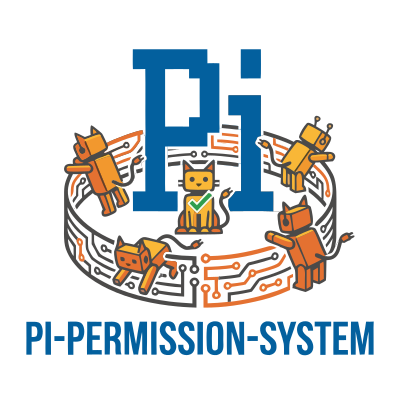

<p align="center">
  
</p>

# @gotgenes/pi-permission-system

[](https://www.npmjs.com/package/@gotgenes/pi-permission-system) [](https://github.com/gotgenes/pi-packages/actions/workflows/ci.yml) [](https://opensource.org/licenses/MIT) [](https://www.typescriptlang.org/) [](https://pnpm.io/) [](https://pi.mariozechner.at/)

Permission enforcement extension for the [Pi](https://pi.mariozechner.at/) coding agent that provides centralized, deterministic permission gates over tool, bash, MCP, skill, and special operations.

> **Fork notice:** This package is a full fork of [MasuRii/pi-permission-system](https://github.com/MasuRii/pi-permission-system), published to npm as `@gotgenes/pi-permission-system`.
> It has diverged substantially from upstream in config format, internal architecture, and permission model.

## What It Does

- **Hides disallowed tools** before the agent starts — no wasted turns probing for blocked tools
- **Enforces allow / ask / deny** at tool-call time with UI confirmation dialogs
- **Controls bash commands** with wildcard pattern matching (`git *: ask`, `rm -rf *: deny`)
- **Gates MCP and skill access** at server, tool, and skill-name granularity
- **Protects sensitive file patterns** — cross-cutting `path` rules deny `.env`, `~/.ssh/*`, etc. across all tools and bash at once, matching both the path as referenced and its symlink-resolved form so a deny cannot be evaded through a symlink alias
- **Guards external paths** — prompts before file tools or bash commands reach outside `cwd`
- **Fails closed** — an internal gate error blocks the tool (with a `gate_error` review-log entry and a matching `permissions:decision` broadcast), and a bash command the parser could not resolve, in whole or in part — or an indirection wrapper that hides the gated command (`bash -c`/`eval`, `sudo`, `env`, `xargs`, `find -exec`, …) — prompts (`ask`) rather than passing silently, unless the wrapped command is a pure reader whose direction is provable whatever it is fed (`xargs grep -l foo`)
- **Forwards prompts from subagents** — `ask` policies work even in non-UI execution contexts
- **Broadcasts UI prompt events** — `permissions:ui_prompt` fires only when the permission system is about to invoke the active user-facing permission UI, and every prompt it announces — including one forwarded up from a subagent — is answered by a `permissions:decision` on the same bus
- **Native [`@gotgenes/pi-subagents`](https://github.com/gotgenes/pi-subagents) integration** — in-process child sessions register with the permission system automatically, enabling per-agent policy enforcement and `ask`-state forwarding to the parent UI without configuration

## Install

```bash
pi install npm:@gotgenes/pi-permission-system
```

## Quick Start

1. Create the global config file at `~/.pi/agent/extensions/pi-permission-system/config.json`:

    ```jsonc
    {
      "permission": {
        "*": "allow",
        "path": {
          "*": "allow",
          "*.env": "deny",
          "*.env.*": "deny",
          "*.env.example": "allow"
        },
        "bash": {
          "*": "ask",
          "rm -rf *": "deny",
          "sudo *": "ask"
        },
        "external_directory": "ask"
      }
    }
    ```

2. Start Pi — the extension automatically loads and enforces your policy.

All permissions use one of three states:

| State   | Behavior                                 |
| ------- | ---------------------------------------- |
| `allow` | Permits the action silently              |
| `deny`  | Blocks the action with an error message  |
| `ask`   | Prompts the user for confirmation via UI |

When the dialog prompts, you can approve once or approve a pattern for the rest of the session.
In an interactive TUI session the prompt is an inline keybind dialog — `y` approve, `s` approve for this session, `n` deny, `r` deny with a reason — where each hotkey arms and a second press confirms (configurable via `doublePressToConfirm`).
A file-access ask that proves a single direction offers `b` as well, granting the session both directions instead of only the one the gate proved.
The prompt shows one fact per line — who is asking, the tool, the matched rule, the value being decided — within a row budget, so a large tool input cannot take over the transcript; `Ctrl+O` (`app.tools.expand`) expands it to the complete request.
See [docs/configuration.md](docs/configuration.md#inline-permission-dialog-tui) for the hotkeys and [docs/session-approvals.md](docs/session-approvals.md) for session-scoped rules and pattern suggestions.

The `path` surface is a cross-cutting gate that applies to **all** file access — Pi tools, bash commands, MCP calls, and extension tools alike.
Extension and MCP tools that operate on paths (via `input.path`, MCP's `input.arguments.path`, or a registered access extractor) are gated by default, so a `path` deny cannot be overridden by a per-tool allow — making it the right place to protect sensitive files like `.env` or `~/.ssh/*` from every tool at once.
A `path` pattern matches both the path as the agent references it and its canonical (symlink-resolved) form, so a deny still fires when a symlink aliases a sensitive target.

For per-tool path patterns (`read`, `write`, `edit`, `find`, `grep`, `ls`), patterns are matched against the file path from `input.path`.
This lets you express rules like "allow reads but deny `.env` files" at the individual tool level.
Like the cross-cutting `path` surface, per-tool patterns match both the referenced path and its canonical (symlink-resolved) form, so a per-tool deny resists symlink-alias evasion.
When Pi's current working directory is known, relative path inputs also match their cwd-normalized absolute form, so `src/App.jsx` can match both `src/*` and `/workspace/project/*`.

The `external_directory` surface is the CWD-boundary gate: it decides whether reaching **outside** the working tree is allowed, and accepts a pattern map so you can allow specific outside-CWD directories without opening up all external access.
This is the right surface for silencing repeated prompts on a local cache like `~/.cargo/registry` — allow it here, not on `path`:

```jsonc
{
  "permission": {
    "external_directory": {
      "*": "ask",
      "~/.cargo/registry/*": "allow"
    }
  }
}
```

The trailing `*` is greedy and crosses subdirectory boundaries, so it allows every file beneath the directory; a bare `~/.cargo/registry` matches only the directory entry itself.

Four layers compose with most-restrictive-wins: `path` (cross-cutting) → `external_directory` (CWD boundary) → per-tool patterns → `bash` command patterns.
Because `ask` is more restrictive than `allow`, a `path` allow cannot loosen an `external_directory: ask` boundary — allow outside-CWD directories on `external_directory`.
See [docs/configuration.md](docs/configuration.md) for the full recipe.

Both path surfaces also carry a **direction**, so you can permit reading somewhere without permitting writing there: `path_read`, `path_write`, `external_directory_read`, and `external_directory_write`.
A bare `path` or `external_directory` key is sugar that expands into both of its directional keys, so every existing config keeps its exact meaning and remains the right spelling whenever direction does not matter.

```jsonc
{
  "permission": {
    "external_directory": { "*": "ask" },
    "external_directory_read": { "~/dev/*": "allow" }
  }
}
```

Here a `read` under `~/dev` is silent while a `write` or `edit` to the same path still prompts.
The useful grants are `*_read: allow` and the bare key; `*_write` earns its keep as a restriction (`path_write: { "*": "deny" }` is a read-only-agent posture) — see [docs/configuration.md](docs/configuration.md#directional-path-surfaces).

A read grant reaches bash commands too, not just the file tools: a redirect operator proves its destination's direction (`> out.txt` writes, `< in.txt` reads), and a frozen set of read-only command words — `cat`, `grep`, `ls`, `find`, and 17 others — proves a read for the paths they name.
A token nothing proves still consults both directions, so an unrecognized command is never treated as the safer one.

## Configuration

Config lives in one JSON file per scope:

| Scope   | Path                                                      |
| ------- | --------------------------------------------------------- |
| Global  | `~/.pi/agent/extensions/pi-permission-system/config.json` |
| Project | `<cwd>/.pi/extensions/pi-permission-system/config.json`   |

Project overrides global; per-agent YAML frontmatter overrides both.
Project config (policy and runtime knobs) is loaded only once the project is trusted — in an untrusted directory only global config applies, so an untrusted repository cannot loosen your global policy (see [Upgrading](#2200--project-config-requires-project-trust)).

Within a surface map like `bash` or `mcp`, **last matching rule wins** — put broad catch-alls first and specific overrides after.

The optional `shellTools` field records which non-`bash` tools carry shell semantics (e.g. an `exec_command` tool that replaces native `bash`), so they are gated at full parity with native `bash` — see [docs/configuration.md](docs/configuration.md#shelltools--gating-aliased-shell-tools).

The optional `authorizerChain` field names registered case-by-case decision links (e.g. a light model judge) to consult when a request lands on `ask`, ahead of the interactive prompt.
A downstream extension registers a link via `getPermissionsService(sessionId).registerAuthorizer(name, authorize)`; it decides nothing until you name it here (opt-in), config order fixes the chain order, and the chain owner caps any link's `allow` on the `external_directory`/`path` surface families to keep it within your policy — see [docs/configuration.md](docs/configuration.md#authorizer-chain--case-by-case-decision-links).
A subagent's ask is reviewed by the chain of the session serving it, one hop up, rather than inside the subagent — see the same section.
[`@gotgenes/pi-permission-model-judge`](https://github.com/gotgenes/pi-packages/tree/main/packages/pi-permission-model-judge) is a first-party reference implementation of such a link — a deny-first reviewer that auto-denies mistyped out-of-directory paths.

For the full reference — all surfaces, runtime knobs, per-agent overrides, merge semantics, and common recipes — see [docs/configuration.md](docs/configuration.md).

## Upgrading

### 22.0.0 — project config requires project trust

Project-scoped configuration (the project `config.json` and project-agent frontmatter — both permission policy and runtime knobs such as `yoloMode`) is now loaded only when Pi reports the project as trusted.
In an untrusted directory, only global config applies; a skip is surfaced with a warning and a `project_trust.skipped` review-log entry.
Grant project trust (or set `defaultProjectTrust`) to load a project's config.
See [docs/migration/0644-project-trust-gating.md](docs/migration/0644-project-trust-gating.md).

### 16.0.0 — the bash gate now fails closed

The permission gate fails closed: an internal gate error blocks the tool (with a `gate_error` review-log entry) instead of running it ungated, and a non-empty bash command that cannot be parsed resolves to `ask` (sentinel `<unparseable-bash-command>`) rather than falling through to a permissive top-level `*`.
Commands that previously slipped through silently on the error or empty-parse path now block or prompt.

If you relied on the old permissive behavior for bash, set an explicit permissive bash policy — `"bash": { "*": "allow" }` — which also suppresses the new startup warning emitted when a top-level `"*": "allow"` leaves bash ungated.

## Scope and non-goals

**Purpose.**
An agent takes many actions, most of them benign, but some of which need a human to confirm they are safe or correct.
This package routes your attention to those, and turns each ruling into deterministic, reusable policy — enforced at the host level rather than by asking the model to police itself.

**In scope.**
Hardening the gates against bypass, fail-closed corrections (breaking ones included), named opt-in extension seams for downstream packages, and structural work backed by a written decision record.

**Non-goals.**

- _Implementing isolation._
  This is a decision layer — it decides and records; a sandbox contains.
  The two are complementary: a sandbox settles which paths are in scope and in which direction, and this package decides whether a particular action on an in-scope path may proceed.
  If a dangerous action is reachable through an allowed tool, policy has to restrict it explicitly.
- _Deciding project trust._
  A policy enforcer, not a trust oracle: whether a project is trusted is Pi's decision and yours, and this package observes it.
- _Permissive defaults, trust profiles, or workflow presets._
  Your risk profile is not knowable from here, so defaults are least-privilege and common policies ship as documented recipes rather than preset keywords.
- _Guessing what is sensitive._
  No built-in secret denylist, and log redaction is key-name-structural rather than predictive — a redactor that silently misses a key invites treating the log as safe to share.
- _Model judgment in the core._
  This package makes no LLM call and holds no model config; model-assisted judging attaches as a chain link over the authorizer seam instead.
  A link decides nothing until you name it in `authorizerChain`, and its `allow` on an excluded surface is downgraded to `defer`.

The [architecture doc](https://github.com/gotgenes/pi-packages/blob/main/packages/pi-permission-system/docs/architecture/architecture.md#scope-and-non-goals) carries the full inventory, with the decision record behind each entry.

**One decision is still open.**
How policy may _enter_ the system — which channels are admissible, and with what precedence — is being worked out in [issue #799](https://github.com/gotgenes/pi-packages/issues/799).
Several requested widenings are parked on it rather than declined, durable persistence of an approval among them.
The companion question — whether a capability model replaces the actor-keyed surface list — is settled: [ADR 0013](https://github.com/gotgenes/pi-packages/blob/main/packages/pi-permission-system/docs/decisions/0013-permission-policy-model.md) adds read/write as an axis beside the existing keys, so a policy can permit reading a path without also permitting writes to it.

**Where adjacent requests belong.**
True isolation of a permitted action → an agent sandbox, which this package's scope decisions are exported to rather than duplicated in.
Model-assisted judging of an `ask` → a chain link over the authorizer seam; [@gotgenes/pi-permission-model-judge](https://www.npmjs.com/package/@gotgenes/pi-permission-model-judge) is the first-party one, and judges mistyped paths.
Approve-and-steer, edit diffs, and risk explanations → a downstream package over the `permissions:decision` event and the presentation seams.

## Documentation

| Document                                                                                                                       | Contents                                                                                                             |
| ------------------------------------------------------------------------------------------------------------------------------ | -------------------------------------------------------------------------------------------------------------------- |
| [docs/configuration.md](docs/configuration.md)                                                                                 | Full policy reference, runtime knobs, per-agent overrides, recipes                                                   |
| [docs/session-approvals.md](docs/session-approvals.md)                                                                         | Session-scoped rules, pattern suggestions, bash arity table                                                          |
| [docs/cross-extension-api.md](docs/cross-extension-api.md)                                                                     | Cross-extension service accessor, event bus integration, prompt and decision broadcasts                              |
| [docs/subagent-integration.md](docs/subagent-integration.md)                                                                   | The subagent adapter convention, permission forwarding, coexistence with subagent extensions                         |
| [docs/guides/permission-frontmatter-for-subagent-extensions.md](docs/guides/permission-frontmatter-for-subagent-extensions.md) | Convention guide for subagent extension authors                                                                      |
| [docs/opencode-compatibility.md](docs/opencode-compatibility.md)                                                               | OpenCode compatibility — shared concepts, divergences, porting guide                                                 |
| [docs/troubleshooting.md](docs/troubleshooting.md)                                                                             | Common issues, diagnostic logging, threat model                                                                      |
| [docs/migration/legacy-to-flat.md](docs/migration/legacy-to-flat.md)                                                           | Migration from pre-v2 config layout                                                                                  |
| [docs/migration/strict-config-validation.md](docs/migration/strict-config-validation.md)                                       | Strict config validation (breaking) — rejected configs, and the cross-scope fail-closed clamp                        |
| [docs/migration/0644-project-trust-gating.md](docs/migration/0644-project-trust-gating.md)                                     | Project-trust gating (breaking) — project config loads only after project trust                                      |
| [docs/migration/0745-prompt-payload-contracts.md](docs/migration/0745-prompt-payload-contracts.md)                             | Prompt payload contracts (breaking) — the forwarded wire, the `ui_prompt` broadcast, and the deprecated preview caps |
| [docs/migration/0746-review-log-fields.md](docs/migration/0746-review-log-fields.md)                                           | Review-log fields (breaking) — `message` replaced by request facts, and the `reviewLogFieldMaxWidth` bound           |
| [docs/migration/0794-keyed-service-locator.md](docs/migration/0794-keyed-service-locator.md)                                   | Keyed service locator (breaking) — `getPermissionsService(sessionId)`, and the repeating ready event                 |
| [docs/migration/0796-remove-process-root-slot.md](docs/migration/0796-remove-process-root-slot.md)                             | Process-root slot removed (breaking) — `getRootPermissionsService()` and its publish/unpublish pair are gone         |
| [docs/migration/0810-per-pattern-approval-surfaces.md](docs/migration/0810-per-pattern-approval-surfaces.md)                   | Per-pattern approval surfaces (breaking) — `ForwardedSessionApproval.grants` replaces `surface` + `patterns`         |

## Development

```bash
pnpm run check       # Type-check TypeScript (no emit)
pnpm run lint        # Biome + ESLint + lint:md
pnpm run lint:md     # rumdl on README and docs
pnpm run test        # Run tests from ./test
pnpm run test:watch  # Run tests in watch mode
```

### Pre-commit hooks

This project uses [prek](https://prek.j178.dev/) to run Biome, ESLint, and rumdl on staged files before each commit.
Run `pnpm install` to set up hooks automatically.

## Acknowledgments

This project began as a fork of [MasuRii/pi-permission-system](https://github.com/MasuRii/pi-permission-system).
Thank you to [MasuRii](https://github.com/MasuRii) for the original work that made this possible.

Thank you to the [OpenCode](https://opencode.ai) team for the permission model design that inspired the flat config format and evaluation semantics used in this extension.

## License

[MIT](LICENSE)
