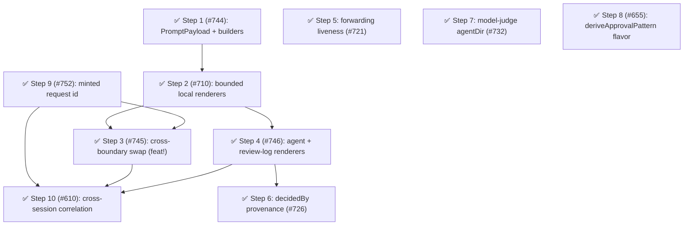

# Phase 13: The prompt-presentation seam

## Findings (planned 2026-08-15)

The declared candidate is [ADR 0011](../../decisions/0011-prompt-presentation-contract.md) (the prompt-presentation contract), whose Staging section assigns its decomposition to this planning pass.
The cause is a structural fusion of presentation with decision-making, recorded in the [Prompt presentation](../architecture.md#prompt-presentation) section above: six sites assemble a flat prompt `message` string (`formatAskPrompt`'s three branches, the skill prompts, the external-directory prompts, `formatPathAskPrompt`, the per-tool previews, and the parent-side forwarded prefix) that travels unchanged to every consumer — the inline dialog, the `select`/`input` fallback, the review log, the `permissions:ui_prompt` broadcast, and the forwarded wire.
Because the payload is a pre-rendered sentence, elision is a payload property rather than a render property: the bash branch has no cap, nothing bounds height ([#710]), a forwarded ask is assembled twice under two configs, and every denial path echoes unbounded input into the agent's context.
The phase implements the contract's staged first step — the complete payload and the renderer seam — so [#710] is fixed by construction and [#713] becomes a conformance requirement of the payload's invariant core rather than a separate enhancement.

Corroboration (fallow + sweeps, 2026-08-15): health 88 (A; deductions are unit size and coupling), dead code 0, duplication 0.2% (the documented intentional `literalTextOf`/`resolveNodeText` pair plus one new 16-line internal clone in `token-collection.ts`).
The repeated-discriminator sweep found no new family — survivors are validation-edge `typeof` guards, per-node AST dispatch, and boundary translation, idiomatic per the taxonomy.
The `value-guards.ts` refactoring target remains rejected (healthy high-fan-in leaf).
The craftsmanship scout re-refuted all three fallow giant-test flags (nested `describe` trees of small behavior-named tests, unchanged since Phase 12) and found one concentrated cluster: six duplicated local test factories (`PermissionCheckResult` builders and `ToolPreviewFormatter` options literals) across `denial-messages.test.ts`, `permission-prompts.test.ts`, and `tool-preview-formatter.test.ts` — exactly the presentation test files the spine rewrites, so the extraction rides Step 1 as a tidy-first prep commit.
Directory check: the spine rewrites the ~8 cohesive presentation modules at the flat `src/` root, so per the recorded reorg convention this phase seeds `src/presentation/` and the touched modules reach their final home the first time.

Open-issue sweep dispositions (user-decided):

- [#710] — adopted as Step 2 (the bounded local renderers are its fix by construction); closed with it.
- PR [#738] (highlight the flagged element in TUI prompts) — swept in during Step 1 planning, having been filed the day before this phase was scoped.
  Highlighting is a **render** concern under ADR 0011, so its intent is adopted in Step 2's dialog renderer with authorship credited, and the PR closes as superseded rather than being rebased — the same disposition [#716] received.
  Both were adopted and credited when Step 2 landed.
- [#713] — its inner-command fact enters the payload in Step 1 and becomes visible in every render in Step 2 (the `runs` line); it closed with Step 2.
- [#721] / [#735] — adopted as Step 5: out-of-process forwarding liveness; [#735]'s scenario 1 (dead parent) is resolved by it, while scenario 2 (a parent whose turn is occupied) stays with the [#722] diagnosis, which remains open and out of scope.
- [#726] — adopted as Step 6 (decision provenance).
- [#732] — adopted as Step 7 (model-judge `agentDir` fix).
- [#655] — adopted as Step 8 (`deriveApprovalPattern` flavor injection).
- [#620] — deferred with recorded rationale: one phase old, non-gating, the `registerAuthorizer` seam it consumes exists, and the phase's capacity goes to the presentation spine; [#698] and [#706] express user demand for the same capability and fold into it when it is scheduled.
- [#519] — kept open with recorded rationale (not a silent re-defer): still externally blocked on Pi SDK `UIContext` evolution; it closes or schedules when the SDK ships the capability.
- [#639] — deferred to a later phase: first sweep since filing, and its policy-model design budget does not fit alongside the presentation spine.
- [#742] — swept out of scope this phase by composition decision (first explicit sweep); it is the last member of the #306/#741 nested-command bypass family and is a strong candidate for the next phase's spine or an independent step.
- [#610] — adopted mid-phase as Step 10, after a [#745] planning question surfaced the gap underneath it.
  It was originally swept out as a feature issue; the sweep read the symptom (a parent-side consumer with no terminal signal) without reading the cause.
  Tracing it found three id conventions and no id at all on any non-prompting path, so the local foundation split out as Step 9 ([#752]) and this issue narrowed to the cross-session half it actually reported.
- [#752] — filed mid-phase as Step 9, the foundation Step 10 needs.
- [#751] — filed by Step 3's implementation; deferred to a later phase, not folded back into Step 2.
  It is the residual of Step 2's own contract (ADR 0011 §4's reachable complete view), twice parked: [#710]'s plan parked the `select`/`input` fallback here for Step 3, and Step 3 did not resolve it either.
  Step 2 shipped and released, so its `Outcome:` is narrowed to name the dialog rather than reopened.
- [#753] — filed by Step 9's planning; folded into Step 10's scope rather than deferred.
  It is the same defect class at a second site — a blocking path that emits no terminal `permissions:decision` — and it consumes the request id Step 9 mints, so the two close together.
- Feature issues [#736], [#720], [#691], [#688], [#687], [#686], [#680], [#658], [#609], [#604], [#603], [#699] — out of scope for a structural phase; [#654] and [#648] become downstream packages over the annotator and evidence-formatter seams per ADR 0011 §8, which are themselves deferred until the payload exists.

Trajectory: Phase 12's maximum step priority was 20; this phase's is 20 (Step 1).
No decline, so the regular rotation continues.

## Health metrics

| Metric                                                                                                  | Baseline (2026-08-15) | Phase 13 target |
| ------------------------------------------------------------------------------------------------------- | --------------------- | --------------- |
| Flat-assembler sites (`formatAskPrompt` references in `src/`)                                           | 4                     | 0 ✅            |
| Forwarded-wire `message: string` field (`permission-forwarding.ts`)                                     | 1                     | 0 ✅            |
| Broadcast `message: string` field (`permission-ui-prompt.ts`)                                           | 1                     | 0 ✅            |
| `src/presentation/` domain directory present                                                            | 0                     | 1 ✅            |
| Legacy `message` render sites (`renderLegacyMessage` in `src/`)                                         | 17                    | 0 ✅            |
| Forwarding-liveness module present (`authority/forwarding-liveness.ts`)                                 | 0                     | 1 ✅            |
| `decidedBy` provenance sites in `src/`                                                                  | 0                     | ≥ 1 ✅          |
| Request-id mint sites in `src/`                                                                         | 2                     | 1 ✅            |
| `requestId` fields in `permission-events.ts` (ui\_prompt + decision)                                    | 1                     | 2 ✅            |
| Terminal decision emit in the fail-closed boundary (`emitDecision` in `handlers/tool-call-boundary.ts`) | 0                     | ≥ 1 ✅          |
| Parent-side served decision emit (`emitDecision` in `authority/forwarded-request-server.ts`)            | 0                     | ≥ 1 ✅          |
| Model-judge resolves `agentDir` via `getAgentDir` (`extension.ts`)                                      | 0                     | ≥ 1 ✅          |
| Ambient `node:path` import in `session-rules.ts`                                                        | 1                     | 0 ✅            |
| fallow health score                                                                                     | 88 (A)                | ≥ 88            |
| Production duplication                                                                                  | 0.2%                  | ≤ 0.2%          |
| Dead exports                                                                                            | 0                     | 0               |

Recompute commands (run from the repo root):

- Flat-assembler sites: `grep -rn "formatAskPrompt" packages/pi-permission-system/src --include="*.ts" | wc -l`
- Wire message field: `grep -c "message: string" packages/pi-permission-system/src/authority/permission-forwarding.ts`
- Broadcast message field: `grep -c "message: string" packages/pi-permission-system/src/permission-ui-prompt.ts`
- Presentation directory: `ls packages/pi-permission-system/src | grep -c presentation`
- Legacy message sites: `grep -rn "renderLegacyMessage" packages/pi-permission-system/src --include="*.ts" | wc -l`
- Liveness module: `ls packages/pi-permission-system/src/authority | grep -c "forwarding-liveness"`
- Provenance sites: `grep -rn "decidedBy" packages/pi-permission-system/src | wc -l`
- Id mint sites: `grep -rnE "Math\.random\(\)\.toString\(36\)|randomUUID\(\)" packages/pi-permission-system/src --include="*.ts" | wc -l`
- Event request ids: `grep -c "requestId" packages/pi-permission-system/src/permission-events.ts`
- Boundary decision emit: `grep -c "emitDecision" packages/pi-permission-system/src/handlers/tool-call-boundary.ts`
- Served decision emit: `grep -c "emitDecision" packages/pi-permission-system/src/authority/forwarded-request-server.ts`
- Model-judge agentDir: `grep -c "getAgentDir" packages/pi-permission-model-judge/src/extension.ts`
- Ambient path import: `grep -c "node:path" packages/pi-permission-system/src/session-rules.ts`
- Health/duplication/dead exports: `pnpm fallow health --score --workspace @gotgenes/pi-permission-system` / `pnpm fallow dupes --workspace @gotgenes/pi-permission-system` / `pnpm fallow dead-code --workspace @gotgenes/pi-permission-system`

The presentation-directory, liveness-module, `decidedBy`, and `getAgentDir` rows grep for names the phase has not created yet; the step that creates each (Steps 1, 5, 6, 7 respectively) must either use the roadmap's name or update the metric row in the same commit.
The two request-id rows were added mid-phase with Steps 9 and 10, and the legacy-message row with Step 4, so their baselines are measured at that point rather than at the phase-open snapshot.
The two decision-emit rows were added with Step 10; both files predate the phase, and neither emitted a decision at the phase-open snapshot, so their `0` baselines hold as written.

## Steps

### ✅ Step 1: `PromptPayload` and its builders — the assembly sites become one payload ([#744])

**Cause:** presentation is fused with decision-making — each gate renders its facts into a sentence at the point of decision, so no consumer downstream can render under its own budget; the flat `message` string is the fusion made concrete.

- **Smell:** Category C (coupling/boundary flaw — the payload/render boundary does not exist).
- **Target:** new `src/presentation/prompt-payload.ts` (the `PromptPayload` type per ADR 0011 §2 — `request` invariant core, `evidence`, `annotations` slot — plus builders); `permission-prompts.ts`, `handlers/gates/external-directory-messages.ts`, and the skill-prompt formatting migrate into `src/presentation/` as payload builders; the gate descriptors emit the payload alongside the facts they already compute; `PromptPermissionDetails` carries it; `message` is derived *from* the payload during the transition (lift-and-shift, no consumer changes yet).
  The payload's `request.executedUnit` carries the inner command of an unstrippable wrapper — [#713]'s fact, entering here.
  Tidy-first prep commit: extract the scout's duplicated fixtures (`makePermissionCheckResult`, a shared `ToolPreviewFormatter` factory) into `test/helpers/` and migrate the three presentation test files.
- **Outcome:** every ask has a complete structured payload; `grep -rn "formatAskPrompt" packages/pi-permission-system/src --include="*.ts" | wc -l` goes 4 → 0; `ls packages/pi-permission-system/src | grep -c presentation` goes 0 → 1; behavior is unchanged (the derived `message` is byte-compatible or near-compatible, pinned by existing tests).
- **Landed:** both metrics hit their targets, and `message` is byte-identical — every former assembler's string assertion now runs against `renderLegacyMessage`, which reads the payload alone, so the suite is the proof the payload is complete.
  `PromptPermissionDetails.payload` is **required**, making "every ask carries a complete payload" a compile-time guarantee rather than a convention.
  Planning found a **sixth** assembler the issue and ADR 0011 both omit — `formatPathAskPrompt`, with two consumers — and found that [#713]'s fact had no source at all: `classifyWrapperCommand` only flagged a wrapper, so the new `wrapper-analysis.ts` resolves what one actually runs.
  Three departures from ADR 0011 §2's illustrative type are documented at their declarations: a `kind` discriminant, `| null` over `| undefined` (the payload goes on the JSON wire in Step 3), and `commandContext` as a request fact.
- **Impact 5 / Risk 2 / Priority 20.**

Release: batch "presentation-payload"

### ✅ Step 2: Bounded local renderers — the dialog and fallback render the payload under a budget ([#710])

**Cause:** same cause, consumed at the human's decision surface — with no renderer layer, the dialog shows whatever the assembler produced, so a subagent's oversized tool input takes over the parent's viewport and the operator decides blind or scrolls away the transcript.

- **Smell:** Category C, with the user-visible symptom filed as the [#710] bug.
- **Target:** new `src/presentation/dialog-renderer.ts` rendering the payload for the inline TUI dialog and the `select`/`input` fallback under a row budget plus a per-field width cap (ADR 0011 §5), with marked elision and a reachable complete view (§4); [#716]'s aligned one-fact-per-line rendering intent adopted here; the invariant core (§3) — including `executedUnit` — always visible, which closes [#713]; the row-budget config field follows the established `config-schema.ts` → `extension-config.ts` → `mergeUnifiedConfigs()` path (the #332/#347 drop class) with `pnpm run gen:schema`.
- **Outcome:** a forwarded ask with pathological input renders within the budget with the complete view reachable **in the inline dialog**; [#710] and [#713] close; the local prompt path no longer reads `details.message`.
  The `select`/`input` fallback gets the budget but not the escape hatch — tracked as [#751], deferred.
- **Landed:** the reported ask — a 200-line here-string, measured at 202 rows locally and 205 forwarded, identically at widths 80/120/160 — renders inside the 24-row default with its request facts intact.
  Planning settled the reading that makes that possible: §3's "never elided" means never *omitted*, so the field cap applies to the core and §5's own here-string rationale is coherent with it.
  The row budget therefore bounds evidence and the field cap bounds the core, with an entry admitted whole or dropped.
  `Ctrl+O` gained the dialog's own expansion alongside its host forward ([#642]) rather than a second binding, and the hint names it only when the render dropped something.
  PR [#738]'s highlight target is derived from the payload rather than carried as a `PromptPermissionDetails` field, so it cannot drift from the rendered text.
- **Impact 5 / Risk 3 / Priority 15.**

Release: batch "presentation-payload"

### ✅ Step 3: The cross-boundary swap — payload replaces `message` on the wire and the broadcast ([#745])

**Cause:** same cause at the two cross-boundary contracts — the forwarded wire relays the child's prose (assembled under the child's config) and the broadcast ships the full sentence to any unconsented observer, so consistency across local and forwarded asks is structurally unattainable and the bus over-discloses.

- **Smell:** Category C (boundary flaw), with the ADR 0011 §6 broadcast narrowing as the disclosure fix.
- **Target:** `src/authority/permission-forwarding.ts` (the request carries the payload, `message` removed), `src/authority/approval-escalator.ts` (child serializes it), `src/authority/forwarded-request-server.ts` (serving renders the child's facts under the parent's budget; a version-skewed request without a payload renders from whatever fields it carries, never empty — ADR 0011 §9), `src/permission-ui-prompt.ts` (broadcast narrowed to the `request` facts; forwarded provenance retained in full), soft-deprecation of `toolInputPreviewMaxLength`/`toolTextSummaryMaxLength` via the config-issue channel (§5).
  Breaking: `feat!:` with a migration note naming the payload fields that supersede `message` on both contracts.
- **Outcome:** `grep -c "message: string"` goes 1 → 0 in both `permission-forwarding.ts` and `permission-ui-prompt.ts`; a forwarded ask renders identically in kind to a local one; the bus discloses request facts and verdicts only.
- **Impact 4 / Risk 3 / Priority 12.**
- **Landed:** both metric rows are `0`; `asPromptPayload` (an all-or-nothing tolerant guard beside its type) admits the payload through the wire's `asX` reader, and the required-core gate no longer demands `message`, so an older child's request is served from its display fields rather than rejected.
  `docs/migration/0745-prompt-payload-contracts.md` names the superseding fields and the upgrade-the-parent-first ordering.
  The [#710] row-budget invariant was re-measured at the new shape — the reported here-string ask arriving as `kind: "bash"` with the child's real evidence — and stays inside the 24-row default.

Release: batch "presentation-contract"

### ✅ Step 4: The agent-facing and review-log renderers ([#746])

**Cause:** the same unbounded payload that took over the viewport is echoed verbatim into the agent's context on every denial (the human's constraint is rows; the agent's is tokens), and the review log persists prompt wording as a side effect of assembly rather than as a configured render.

- **Smell:** Category C, plus the log-growth concern of `docs/decisions/0010-permission-log-secret-exposure.md`.
- **Target:** `denial-messages.ts` migrates to `src/presentation/agent-renderer.ts` under ADR 0011 §7 — the agent renderer identifies the call (surface, matched pattern, verdict, the human's typed reason) and never reproduces its input; the review-log write path (`permission-prompter.ts` / `session-logger.ts`) renders the payload under its existing configured limits instead of persisting `message`.
- **Outcome:** denial text is structurally bounded (no raw-command interpolation on any denial path); the review log's growth is a configured decision; key-name redaction unchanged.
- **Impact 3 / Risk 2 / Priority 12.**
- **Landed:** `grep -rn "renderLegacyMessage" src` goes 17 → 0 — the review log was the last `message` reader, so `legacy-message.ts` went with it and `PromptPermissionDetails.message` is gone.
  Planning settled the reading §7 leaves open: *identifying* a call includes naming which of its operands the rule fired on, while *reproducing* it means echoing the command or the tool-input body, which no render does.
  The flagged element is therefore rendered under a field cap rather than structurally excluded — the departure is deliberate, because correlation is already structural (Pi returns a block reason as that call's own tool result, stamped with its `toolCallId`, with the call's arguments retained in context) and what the agent cannot recover is sub-call granularity.
  `DenialContext` dissolved into `PromptPayload`: every field it uniquely held is one §7 forbids rendering, and the operator's deny-with-reason text passes from the resolved check as an argument, which also makes it reach the agent on every surface rather than tool and bash alone.
  Measured on a live 7.07 MB review log: dropping `message` (21.5%) and capping every field at the new `reviewLogFieldMaxWidth` (a further 7.1%, all of it `command`) removes 28.7%, shortening 4.3% of command entries.
  The bound went to `writeLine` rather than each renderer, and the log facts to `GateRunner` rather than each of the seven gates, on the same reasoning: a producer cannot forget what it never supplies.

Release: batch "presentation-contract"

### ✅ Step 5: Out-of-process forwarding liveness ([#721], fixes [#735] scenario 1)

**Cause:** the forwarding timeout conflates "a human is deliberating" with "nobody is home" — for an out-of-process child (which shares no `globalThis` with its parent) the 10-minute `PERMISSION_FORWARDING_TIMEOUT_MS` is the only signal, so every ask forwarded to a dead parent burns the full timeout and reports a denial the user never made.
The in-process serving registry (#719) already made the two distinguishable for in-process children; the filesystem channel lacks the equivalent.

- **Smell:** Category C (lifecycle/boundary flaw at the cross-process edge).
- **Target:** new `src/authority/forwarding-liveness.ts` (a filesystem liveness signal — [#721] names two candidate mechanisms, claim artifact or serving heartbeat; `/plan-issue` picks on ergonomics), `src/authority/forwarding-manager.ts` (serving node maintains the signal), `src/authority/approval-escalator.ts` (child fast-fails on absent/stale liveness after a short grace, with a path-naming `denialReason` and `confirmationUnavailable`, matching the in-process judgement's safe direction).
- **Outcome:** a child forwarding to a target no live session is draining abandons in seconds instead of 600, resolving [#735] scenario 1; scenario 2 stays with [#722]; `ls packages/pi-permission-system/src/authority | grep -c "forwarding-liveness"` goes 0 → 1.
- **Impact 4 / Risk 3 / Priority 12.**
- **Landed:** the metric is 1, and the mechanism choice went to the heartbeat on a constraint the issue's framing did not carry: `processInbox` drains serially, awaiting each escalation, so a per-request claim would leave a second request unclaimed for as long as a human deliberates on the first — and claiming the whole batch up front degrades the artifact to "the loop saw you" while adding a third file to the tree whose removal ordering produced [#398].
  The records therefore live beside `sessions/`, never inside it, which is what keeps that ordering untouched.
  The load-bearing detail is where the re-announcement sits: `ForwardingManager`'s tick refreshes ahead of its processing guard, because a parent holding `processInbox` open for a deliberating human is serving throughout, and refreshing behind the guard would let its record decay exactly when it is most demonstrably alive.
  The two-channel dispatch went into `ForwardingLivenessJudge` rather than `ParentAuthorizer`, so the poll loop asks one question about a target and the in-process and out-of-process rules cannot drift.
  Absence of a record counts as unserved (user decision at the clarification gate), which is what resolves the reported case — a cleanly exited parent leaves nothing behind — at the cost of an upgrade-ordering requirement now documented in `docs/subagent-integration.md`.
  This deliberately reverses [#719]'s rule that an `env`-resolved target is never fast-failed; a dead pid is judged immediately, while a merely stale record still waits out the staleness window, and no new config field was added.

Release: independent

### ✅ Step 6: Decision provenance — `decidedBy` on permission decisions ([#726])

**Cause:** the decision path knows what decided (human prompt, session approval, config rule, authorizer link, auto-allow, timeout) and discards it before the log write, so an audit cannot distinguish a human approval from an auto-approval — the decision-provenance principle: record what decided and on what basis, not only the outcome.

- **Smell:** Category C (a fact established at the decision point dies before its consumer).
- **Target:** a `decidedBy` discriminated union threaded from the decision sites (`GateRunner`'s fast paths, `PermissionPrompter`, the `Authorizer` chain, `ForwardedRequestServer`) into the review-log entries and the forwarded response; lands after Step 4 so the provenance fields ride the new log renderer rather than the retiring `message` shape.
- **Outcome:** every terminal `permission_request.*` / `forwarded_permission.*` entry names its decider with enough detail to reconstruct the decision; `grep -rn "decidedBy" packages/pi-permission-system/src | wc -l` goes 0 → ≥ 1.
- **Impact 3 / Risk 1 / Priority 15.**
- **Landed:** the metric is 37, and the scope narrowed by user decision during planning: `PermissionDecisionEvent` is **not** touched, because the bus channel's consumers are not yet known and it is the narrowest renderer under ADR 0011 §6.
  Two of the issue's three asks were already answered — [#752] made the request id shared across the forwarding hop, and there is no `/permissions` history view to surface into.
  Each variant is self-contained (it repeats its own surface, pattern, origin, link name, or reason) rather than leaning on a sibling log column: that duplicates `surface` and the pattern locally, and it is the only shape that survives onto the response file, which has no such columns.
  The `forwarded` variant is recursive, so the requesting side records *which session* answered and *what within it* decided as two facts — flattening would make a remote decision read as local.
  Its guard is depth-bounded because the value is read off disk.
  Attribution is stamped at the site that decides, never derived: the mode dispatcher names the human's surface (the dialog model and the fallback return an `UnattributedDecision`, the shape `GateBypass.decision` already used for the request id), the chain names the link at the point its loop breaks, and both absent-authority paths reuse the string they already report to the model so the two cannot drift.
  `decidedBy` is required on `PermissionPromptDecision` and `GateBypass`, making completeness a compile-time guarantee rather than a convention.
  Measured on a live 7.44 MB review log: 1432 terminal prompted decisions carried no decider, and the record adds 95–134 bytes to 5777 decision-bearing lines — a 7.4% worst case, against the 28.7% [#746] removed.

Release: independent

### ✅ Step 7: Model-judge honors `PI_CODING_AGENT_DIR` ([#732])

**Cause:** `pi-permission-model-judge` recomputes the global config scope from a hardcoded `~/.pi/agent` instead of the SDK's `getAgentDir()`, so the two packages disagree about where the global scope lives whenever `PI_CODING_AGENT_DIR` is set — and the configured judge silently never registers, indistinguishable in the review log from "not installed".

- **Smell:** Category F (cross-package divergence on a single source of truth).
- **Target:** `packages/pi-permission-model-judge/src/config-loader.ts` resolves `agentDir` via `getAgentDir()` from `@earendil-works/pi-coding-agent`, as pi-permission-system does.
- **Outcome:** both packages read the global scope from the same directory; `grep -c "getAgentDir" packages/pi-permission-model-judge/src/config-loader.ts` goes 0 → ≥ 1; ships as a `fix:` in the model-judge component.
- **Impact 3 / Risk 1 / Priority 15.**
- **Landed:** `agentDir` resolves at the extension boundary — `src/extension.ts` passes `getAgentDir()` into a now-required parameter — rather than inside `config-loader.ts` as the Target line proposed.
  That was an operator decision at planning time: it matches how this package's own `src/index.ts` and pi-colgrep resolve the same scope, and it keeps the loader free of SDK imports and process-global reads.
  The metric moved with it, and the original `config-loader.ts` grep is not evidence — it returns 1 for a doc-comment mention with no resolution site in that file.
  `cwd` became required in the same change, so the loader now reads neither `homedir()` nor `process.cwd()`.
  Shipped as a `fix:` in `@gotgenes/pi-permission-model-judge` v1.1.3.

Release: independent

### ✅ Step 8: `deriveApprovalPattern` takes the injected `PathFlavor` ([#655])

**Cause:** `deriveApprovalPattern` (`session-rules.ts`) reads `node:path`'s ambient `dirname`/`sep`, bypassing the injected `PathFlavor` that owns every other platform decision — the one surviving violation of the #562/#510 invariant, producing mixed-separator patterns on a real Windows host and untestable win32 behavior on POSIX CI.

- **Smell:** Category C (ambient platform read; decide-once violation).
- **Target:** `src/session-rules.ts` — derive the pattern through the flavor's `impl`/separator, threading the flavor from the call sites that already hold a `PathNormalizer`.
- **Outcome:** `grep -c "node:path" packages/pi-permission-system/src/session-rules.ts` goes 1 → 0; a win32 unit test can pin the derived pattern; ships as a `fix:`, not the `refactor:` this line first assumed — see Landed.
- **Impact 2 / Risk 1 / Priority 10.**
- **Landed:** the metric hit 0, and the step carried a behavior fix the issue reported as cosmetic.
  Threading the flavor alone does not fix the win32 output: `win32.dirname("/dev/null")` is `/dev` while `win32.sep` is `\`, so the derivation had to scope on the separator the *value* carries, not the platform's default.
  Measured at planning time, that single rule replaces all four of the old branches and is byte-identical on POSIX across every value the suite pins, while correcting four win32 rows.
  One of them is a widening: a Git Bash directory token (`/tmp/logs/`, reachable through `forBashToken`'s literal-only branch, [#533]) derived `/tmp\*`, which the symmetric `windowsSeparators` fold ([#653]) then matched against every sibling of the approved directory — verified against the real matcher, so it ships as a `fix:`.
  The home is `PathNormalizer.approvalPatternFor` over a new `path/approval-pattern.ts` leaf (operator decision over the issue's `AccessPath.approvalPattern()` option, which stays open since all `AccessPath` construction already flows through the normalizer).
  `PathFlavor` gained `lastSeparatorIndex`, with `hasPathSeparator` re-expressed over it so the separator alphabet has one home.
  The per-tool gate takes the derived *product* rather than the collaborator — `ToolPathAccess` replaces its `accessPath?` parameter — which keeps `pattern-suggest.ts` free of path-language semantics; its three path-deriving switch arms proved unreachable and were removed.
  Planning found that none of this was testable before: the ambient read resolves against the *host*, so a win32-flavored gate test on POSIX CI exercised POSIX separators and passed either way.
  Each gate now pins the injection with a native Windows path, which the pre-fix code collapsed to `./*`.

Release: independent

### ✅ Step 9: A minted request id, carried on every decision ([#752])

**Cause:** there is no permission request id — there are three conventions, and none covers a request that never prompts.
The tool-call gates borrow the SDK's `toolCallId`, the skill-input gate mints its own, and the escalation edge mints a third that discards the one it was handed; the id attaches inside `promptForApproval`, so session-approved, yolo, infrastructure-auto-allowed and policy-blocked resolutions carry no id at all, and `PermissionDecisionEvent` carries none ever.

- **Smell:** Category C (a fact established at request creation dies before its consumers), the same shape as Step 6.
- **Target:** a single mint at the top of `GateRunner.run` shared by the bypass and descriptor branches; the id carried on the non-prompting review-log writes and added to `PermissionDecisionEvent`; `GateBypass.decision` becomes an `Omit<PermissionDecisionEvent, "requestId">` so a gate keeps emitting only what it knows; `createSkillInputRequestId` deleted.
  `toolCallId` keeps flowing untouched — it is the join back to the Pi transcript, and a distinct fact from the request id.
- **Outcome:** every permission request is correlatable from creation regardless of how it resolves; the mint-site count goes 2 → 1; `grep -c "requestId" packages/pi-permission-system/src/permission-events.ts` goes 1 → 2.
  Additive for consumers, so it needs no major bump of its own.
- **Landed:** both metrics hit their targets, and three of the issue's own shape claims did not survive the code.
  The non-prompting writes are **four**, not three — `policy_denied` is written by `applyPermissionGate` from the log context the runner hands it, so injecting the id there covers it.
  Exactly **one** `GateBypass` carries a `decision` (the infrastructure-read bypass), not three; the other two carry only a `log`.
  And `run`'s third parameter is **deleted**, not narrowed: `requestId: toolCallId` was its only reader.
  The forwarding edge stopped minting its third id and adopts the one it is handed, so a forwarded ask carries one id from the child's gate to the human's decision — which supersedes Step 3's planned `requesterRequestId` wire field.
  Two decisions beyond the issue: `randomUUID` over the package's `<ts>-<rand>-<pid>` convention (Node has no UUIDv7 — `randomUUID({ version: 7 })` silently returns a v4), and a filename-safety guard on the adopted id, since adoption is what first lets an inbound id name an outbound file.
  The gate-error boundary's missing `permissions:decision` was found here and filed as [#753].
- **Impact 3 / Risk 1 / Priority 15.**

Release: independent

### ✅ Step 10: Cross-session prompt/decision correlation ([#610], with [#753])

**Cause:** a forwarded ask's prompt is emitted by the parent and its terminal decision by the child, on a different event bus for an out-of-process child — so a parent-side consumer that marks an agent blocked on `permissions:ui_prompt` has no public signal to clear it and can stay blocked forever.
Measured on the review log: 53 of 57 `forwarded_permission.request_created` entries carry an id appearing on no `permission_request.*` entry, the child's ask and the request the parent serves joined by nothing but a one-millisecond timestamp gap.

- **Smell:** Category C (boundary flaw — a lifecycle observable on one side of the forwarding edge and not the other).
- **Target:** `src/authority/forwarded-request-server.ts` emits a parent-side `permissions:decision` after the serving session's human decision, reusing the request id its own `permissions:ui_prompt` carried; `ForwardedPermissionRequest.id` **is** the child's originating `requestId` (Step 9), so it already joins the two sides' log entries.
  Silent policy resolutions stay silent — no prompt, no terminal event, unchanged.
  The step also closes [#753], the same defect at a second site: `createFailClosedToolCall` (`src/handlers/tool-call-boundary.ts`) is the only path that blocks a tool call without a terminal broadcast.
  It adds `gate_error` to `PermissionDecisionResolution` and emits from the boundary's `catch` using the `DecisionReporter` it already holds, carrying Step 9's `requestId`.
- **Outcome:** a direct prompt and its decision share one id; a forwarded prompt and its parent-side decision share one id on one bus; concurrent equivalent prompts stay independently correlatable; **every** blocking path emits a terminal `permissions:decision`.
- **Landed:** the emit covers every forwarded ask the serving node *escalates*, not only the ones a human answered.
  Planning found the narrower reading leaves the reported bug intact at a rarer site: a dialog that throws does so *after* the `permissions:ui_prompt` broadcast is already out, and `ForwardedRequestServer`'s existing `catch` is the only place that sees it.
  The escalation branch is therefore the emit site, which also makes "silent stays silent" structural — recorded authority returns before it — rather than a predicate over the decision.
  The event renders from the same `PromptPermissionDetails` the prompt did, so the shared projection is a property of the code rather than a convention; a version-skewed request with no display fields falls back to the payload's own non-nullable request facts instead of a sentinel.
  Two additions beyond the issue: an optional `forwarding` context on `PermissionDecisionEvent` (operator decision — already disclosed on the same bus by `ui_prompt`, and it tells a served decision from a local one), and `gate_error` doing double duty as [#753]'s boundary resolution and the failed-escalation resolution here.
  The step also found that an `authorizerChain` link's verdict is reported as `user_approved`/`user_denied` on the local path too, since `GateRunner` never reads the decision's `decidedBy`; filed as [#772] rather than folded in, because correcting it changes an existing resolution value.
- **Impact 3 / Risk 2 / Priority 12.**

Release: independent

## Step dependency diagram

## Parallel tracks

- **Track A — prompt-presentation spine:** Steps 1 → 2 → {3, 4}.
- **Track B — forwarding liveness:** Step 5 (touches `authority/` forwarding files only; disjoint from Track A apart from `approval-escalator.ts`, which Track A's Step 3 also edits — land Step 5 before or after Step 3, not concurrently).
- **Track C — decision provenance:** Step 6, after Step 4.
- **Track D — independent fixes:** Steps 7 and 8, any time.
- **Track E — request identity:** Step 9, then Step 10 after Step 4.
  Step 9 was disjoint from Track A apart from `permission-events.ts`, which Step 3 also edits (different interfaces in the same file) — it landed **before** Step 3, and its id adoption retired the `requesterRequestId` wire field Step 3 had planned, so Step 10 finds both halves in place.
  Step 10 and Step 6 both enrich the review-log write path; land them in sequence.

The step numbers are discovery order, not execution order: Steps 9 and 10 were added mid-phase, and Step 9 runs before Step 3.
The diagram above is the authority on sequencing.

## Release batches

- **Batch "presentation-payload":** Steps 1, 2 (ship together; tail = Step 2; release vehicle = Step 2's `fix:` for [#710] — Step 1 is a hidden `refactor:`).
- **Batch "presentation-contract":** Steps 3, 4 (ship together; tail = Step 4; release vehicle = Step 3's `feat!:` breaking release with the `message`-replacement migration note).
- Independently releasable: Step 5 (`fix:`), Step 6 (`feat:`), Step 7 (`fix:`, model-judge component), Step 8 (`fix:` — retyped from `refactor:` once planning measured the win32 widening it corrects), Step 9 (`feat:`), Step 10 (`feat:`).

## Completion

All 10 steps are closed: [#744], [#710], [#745], [#746], [#721], [#726], [#732], [#655], [#752], [#610] (with [#753]).
[#713] closed with Step 2, and PR [#738] closed as superseded (credited) with Step 2, per this phase's open-issue sweep dispositions — the same disposition PR [#716] received.
[#753] was filed by Step 9's planning and closed with Step 10.
[#772] was filed by Step 10's implementation and remains open and non-gating: it tracks a pre-existing `authorizerChain` link misattribution the step found but did not fold in, because correcting it changes an existing resolution value.
[#751] was filed by Step 2's implementation (parked from [#710]'s plan, and parked a second time when Step 3 did not resolve it either) and remains open and non-gating: it tracks the `select`/`input` fallback's missing escape hatch to the complete request.
Issues swept and confirmed out of scope during planning, both by decision and non-gating: [#620] (allow-capable opaque-bash adjudicator — deferred, one phase old, the `registerAuthorizer` seam it consumes already exists; [#698] and [#706] fold into it when scheduled), [#519] (externally blocked on Pi SDK `UIContext` evolution), [#639] (policy-model design budget deferred to a later phase), [#742] (nested-command bypass family, swept out as a candidate for the next phase's spine), [#735] scenario 2 (a parent whose turn is occupied, stays with the [#722] diagnosis).

### Delivered vs. predicted metrics

Recomputed at archive time (`pnpm fallow health --score --workspace @gotgenes/pi-permission-system` / `pnpm fallow dupes --workspace @gotgenes/pi-permission-system` / `pnpm fallow dead-code --workspace @gotgenes/pi-permission-system`):

| Metric                                                                                                  | Phase 13 target | Delivered                                                                             |
| ------------------------------------------------------------------------------------------------------- | --------------- | ------------------------------------------------------------------------------------- |
| Flat-assembler sites (`formatAskPrompt` references in `src/`)                                           | 0               | 0 — met                                                                               |
| Forwarded-wire `message: string` field (`permission-forwarding.ts`)                                     | 0               | 0 — met                                                                               |
| Broadcast `message: string` field (`permission-ui-prompt.ts`)                                           | 0               | 0 — met                                                                               |
| `src/presentation/` domain directory present                                                            | 1               | 1 — met                                                                               |
| Legacy `message` render sites (`renderLegacyMessage` in `src/`)                                         | 0               | 0 — met                                                                               |
| Forwarding-liveness module present (`authority/forwarding-liveness.ts`)                                 | 1               | 1 — met                                                                               |
| `decidedBy` provenance sites in `src/`                                                                  | ≥ 1             | 38 — met                                                                              |
| Request-id mint sites in `src/`                                                                         | 1               | 1 — met                                                                               |
| `requestId` fields in `permission-events.ts` (ui_prompt + decision)                                     | 2               | 2 — met                                                                               |
| Terminal decision emit in the fail-closed boundary (`emitDecision` in `handlers/tool-call-boundary.ts`) | ≥ 1             | 1 — met                                                                               |
| Parent-side served decision emit (`emitDecision` in `authority/forwarded-request-server.ts`)            | ≥ 1             | 1 — met                                                                               |
| Model-judge resolves `agentDir` via `getAgentDir` (`extension.ts`)                                      | ≥ 1             | 3 — met                                                                               |
| Ambient `node:path` import in `session-rules.ts`                                                        | 0               | 0 — met                                                                               |
| fallow health score                                                                                     | ≥ 88            | 88 (A) — met                                                                          |
| Production duplication                                                                                  | ≤ 0.2%          | 0.1% (2 clone groups, 57 lines across 3 files) — met, improved from the 0.2% baseline |
| Dead exports                                                                                            | 0               | 0 — met                                                                               |

[#398]: https://github.com/gotgenes/pi-packages/issues/398
[#519]: https://github.com/gotgenes/pi-packages/issues/519
[#533]: https://github.com/gotgenes/pi-packages/issues/533
[#603]: https://github.com/gotgenes/pi-packages/issues/603
[#604]: https://github.com/gotgenes/pi-packages/issues/604
[#609]: https://github.com/gotgenes/pi-packages/issues/609
[#610]: https://github.com/gotgenes/pi-packages/issues/610
[#620]: https://github.com/gotgenes/pi-packages/issues/620
[#639]: https://github.com/gotgenes/pi-packages/issues/639
[#642]: https://github.com/gotgenes/pi-packages/issues/642
[#648]: https://github.com/gotgenes/pi-packages/issues/648
[#653]: https://github.com/gotgenes/pi-packages/issues/653
[#654]: https://github.com/gotgenes/pi-packages/issues/654
[#655]: https://github.com/gotgenes/pi-packages/issues/655
[#658]: https://github.com/gotgenes/pi-packages/issues/658
[#680]: https://github.com/gotgenes/pi-packages/issues/680
[#686]: https://github.com/gotgenes/pi-packages/issues/686
[#687]: https://github.com/gotgenes/pi-packages/issues/687
[#688]: https://github.com/gotgenes/pi-packages/issues/688
[#691]: https://github.com/gotgenes/pi-packages/issues/691
[#698]: https://github.com/gotgenes/pi-packages/issues/698
[#699]: https://github.com/gotgenes/pi-packages/issues/699
[#706]: https://github.com/gotgenes/pi-packages/issues/706
[#710]: https://github.com/gotgenes/pi-packages/issues/710
[#713]: https://github.com/gotgenes/pi-packages/issues/713
[#716]: https://github.com/gotgenes/pi-packages/pull/716
[#719]: https://github.com/gotgenes/pi-packages/issues/719
[#720]: https://github.com/gotgenes/pi-packages/issues/720
[#721]: https://github.com/gotgenes/pi-packages/issues/721
[#722]: https://github.com/gotgenes/pi-packages/issues/722
[#726]: https://github.com/gotgenes/pi-packages/issues/726
[#732]: https://github.com/gotgenes/pi-packages/issues/732
[#735]: https://github.com/gotgenes/pi-packages/issues/735
[#736]: https://github.com/gotgenes/pi-packages/issues/736
[#738]: https://github.com/gotgenes/pi-packages/pull/738
[#742]: https://github.com/gotgenes/pi-packages/issues/742
[#744]: https://github.com/gotgenes/pi-packages/issues/744
[#745]: https://github.com/gotgenes/pi-packages/issues/745
[#746]: https://github.com/gotgenes/pi-packages/issues/746
[#751]: https://github.com/gotgenes/pi-packages/issues/751
[#752]: https://github.com/gotgenes/pi-packages/issues/752
[#753]: https://github.com/gotgenes/pi-packages/issues/753
[#772]: https://github.com/gotgenes/pi-packages/issues/772
