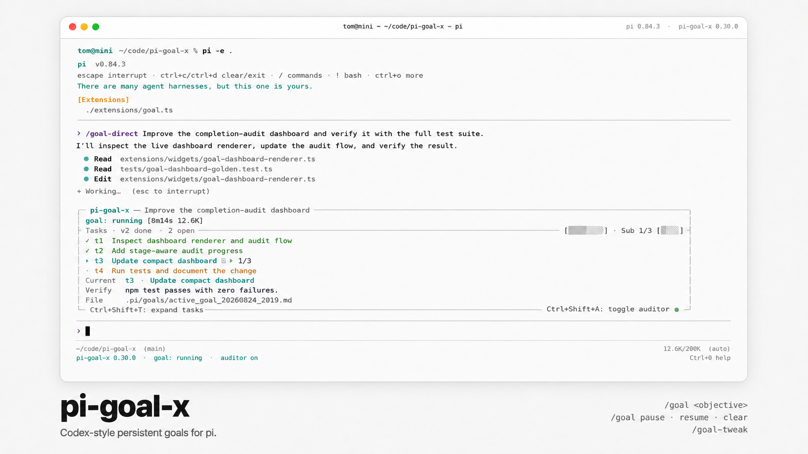

<div align="center">
  
</div>

<div align="center">
  <a href="https://pi.dev/packages" target="_blank" rel="noopener noreferrer">
    <picture>
      <source media="(prefers-color-scheme: dark)" srcset="assets/badge-dark.svg">
      
    </picture>
  </a>
</div>

# pi-goal-x

`pi-goal-x` is a goal-management extension for [pi](https://github.com/earendil-works/pi-coding-agent).

It gives the agent a persistent objective, a structured plan, visible progress, and an independent completion review. Goals remain available across sessions, so the agent can continue working with the same objective and progress record.

## Features

### Regular goals

Regular goals describe an outcome for the agent to achieve. The agent can investigate the work, choose an appropriate sequence, create tasks, and adapt its plan as it progresses.

Regular goals work well for research, implementation, debugging, documentation, and other work where the desired result is clear and the execution path can be determined during the task.

### Sisyphus goals

Sisyphus goals describe work that should be completed in a specific order. The agent follows the listed sequence one step at a time and preserves dependencies between steps.

Sisyphus goals work well for migrations, staged refactors, release procedures, data-processing workflows, and other tasks where each step prepares the way for the next.

### Guided goal creation

The `/goal` and `/sisyphus` commands start a guided drafting process. The agent can ask focused questions, clarify the objective, and propose a task plan for confirmation.

The proposal is written to the conversation as a durable summary (objective, plan, verification, automatic continuation, auditor state); confirming it creates and focuses the goal and starts working automatically.

### Direct goal creation

The `/goal-direct` and `/sisyphus-direct` commands create a goal immediately from a complete objective.

### Persistent progress

Open goals are stored in `.pi/goals/`. Their objectives, tasks, status, and progress remain available across sessions and context changes.

### Multiple open goals

A project can contain several open goals. Each session focuses on one goal at a time, and you can switch between them with `/goal-focus`.

### Tasks and subtasks

Goals can include structured tasks and subtasks. The agent updates their status and records completion evidence as work progresses.

### Verification contracts

Goals and tasks can include plain-text completion requirements, such as:

```text
Run npm test with zero failures.
```

The completion auditor checks these requirements against evidence from the workspace.

### Independent completion review

When the agent reports a goal as complete, a separate pi agent reviews the objective, tasks, verification requirements, and workspace.

Inside a git repository that review also receives a machine-collected change manifest: one section per repository with the paths the goal window changed, their add/delete counts, and ready-to-run `git -C <root> diff <base>` commands to expand on demand. It is evidence, not the executor's claim — the auditor still verifies it against the repository.

Approved goals are archived as complete. Goals requiring additional work remain open with review feedback.

The review runs as a fresh foreground `goal-auditor` child through
`@xzzpig/pi-subagents`. Goal-X registers the default `goal-auditor` agent with
the installed pi-subagents owner at runtime (session start), so the audit
wiring — the child-only progress provider behind the five-stage dashboard, the
read-only tool allowlist, and the structured verdict contract — is code-owned
and cannot be broken by configuration. The Goal-X widget retains the five-stage
summary and result card; use `/subagents-fleet` (or the pi-subagents
Fleet/transcript view) for the child’s detailed messages, thinking, tool
activity, retries, and terminal result. Goal-X no longer opens or stores a
separate audit transcript, and `/goal-audit` is not available.

### Visible status

An above-editor widget shows the focused goal: its status, focus state, other open goals, time and token usage, task progress, the current task, and the goal file path.

Press `Ctrl+Shift+T` to expand the widget into the full unified dashboard — the complete task tree with the current task highlighted, the current task's verification contract and evidence, the goal-level verification contract, and a recent-activity feed derived from the durable goal ledger. Press `Esc` or `Ctrl+Shift+T` again to collapse it.

During an independent completion audit the widget shows a structured audit dashboard (five review stages and a progress bar); after the audit it shows the approval or changes-required result, then returns to the normal view.

### Goal controls

Slash commands let you pause, resume, revise, select, unfocus, and archive goals.

### Configurable behaviour

The settings menu controls task support, verification contracts, subtask depth, goal selection, and the completion auditor.

## Install

Install the compatible subagent runtime as well:

```bash
pi install npm:@xzzpig/pi-subagents
pi install npm:@xzzpig/pi-goal-x
```

The two packages must both be loaded in the same Pi process for completion
reviews. Goal-X deliberately does not register pi-subagents a second time.

Install from a local checkout:

```bash
pi install .
```

Run it once from a local checkout after installing the subagent runtime:

```bash
pi install ../pi-subagents
pi install .
```

Or run both extensions explicitly from their checkouts — Goal-X registers its
default `goal-auditor` with the pi-subagents extension at session start, so no
separate package installation is required:

```bash
pi -ne -ns -np \
  -e ./packages/pi-goal-x/extensions/goal.ts \
  -e ./packages/pi-subagents/index.ts
```

The registered definition references its child-only progress provider by an
absolute path, so completion audits and the five-stage dashboard work from a
bare checkout as well.

## Choose a goal style

Use a **regular goal** when you have a clear outcome and want the agent to determine how to reach it.

For example:

```text
/goal Add account deletion to the application, including the user interface, data cleanup, documentation, and tests.
```

The agent can decide how to investigate the application, divide the work, and order the implementation.

Use a **Sisyphus goal** when you already know the required sequence and want the agent to follow it step by step.

For example:

```text
/sisyphus Migrate authentication in this order:
1. Add the new token validator.
2. Update login to use it.
3. Update session refresh to use it.
4. Remove the old validator.
5. Run the authentication test suite.
```

The agent completes the migration in the stated order, preserving the dependency between each stage.

## Create a guided goal

Start a guided regular goal:

```text
/goal add structured logging to the authentication module
```

The agent can ask questions and propose a complete objective and task plan. Confirm the proposal to create the goal and begin work.

The confirmation dialog also refines in place: choose **Continue chatting — keep refining** and type what you want changed. The goal is not created, drafting stays active, and the text reaches the agent verbatim — no need to reject the draft and wait a turn first.

Structured clarification during drafting is delegated to the optional
[`@eko24ive/pi-ask`](https://www.npmjs.com/package/@eko24ive/pi-ask) package:
when it is installed the agent asks through its `ask_user` tool, and without it
the agent simply asks in plain chat. pi-goal-x does not depend on pi-ask and
registers no question tool of its own — one fewer tool definition in every
request's tool prefix.

The confirm dialog never truncates the question; when it is taller than the terminal it stays within the height and scrolls — `PgUp`/`PgDn` page and `Ctrl+↑/↓` line-scroll without moving the selection, `↑/↓` selection auto-follows into view, and a `▲`/`… +N more` edge indicator shows what is clipped.

Start a guided Sisyphus goal:

```text
/sisyphus prepare and perform the customer-data migration
```

The agent can help define the ordered steps and present them for confirmation.

## Create a goal directly

Use `/goal-direct` when the objective already describes a complete outcome:

```text
/goal-direct Add a health-check endpoint that verifies database connectivity, returns the service status as JSON, documents the endpoint, and includes passing tests.
```

This creates and focuses the regular goal immediately.

Use `/sisyphus-direct` when the objective already contains the complete ordered process:

```text
/sisyphus-direct Upgrade the payment integration in this order:
1. Add support for the new API version.
2. Update payment creation.
3. Update refund handling.
4. Migrate the test fixtures.
5. Run the payment test suite.
6. Remove the old API integration.
```

This creates and focuses the ordered goal immediately.

## Manage goals

List open goals:

```text
/goal-list
```

Show the focused goal:

```text
/goal-status
```

Run read-only storage/runtime health checks:

```text
/goal-status health
```

Re-read goal storage caches (pool, ledger, settings) from disk and report what changed — picks up external edits to `.pi` files without file watchers:

```text
/goal-refresh
```

Select an open goal for the current session:

```text
/goal-focus
```

Remove the current session’s focus while keeping the goal open:

```text
/goal-unfocus
```

Revise the focused objective and task plan:

```text
/goal-tweak <change>
```

Pause or resume the focused goal:

```text
/goal-pause
/goal-resume
```

Archive the focused goal:

```text
/goal-clear
```

Clearing a goal also offers to roll the workspace back. After the confirmation you are asked whether to restore the files the goal window modified or deleted and to remove the files it created; **No** is the default, so a stray Enter only clears. The discarded changes are copied into `.pi/goals/archived/rollback_<timestamp>_<goalId>/` first, no repository HEAD is reset, and your `git stash` list is never touched.

Cancel an unconfirmed guided draft:

```text
/goal-cancel
```

Open the settings menu:

```text
/goal-settings
```

Pressing `Esc` during active work pauses the goal.

## Tasks and verification

The agent can divide a goal into tasks and subtasks and update them as work progresses. The current task is tracked explicitly (persisted as the goal's execution focus) and highlighted in the dashboard; starting a task with `update_goal_task(status="start")` sets it, and completing or skipping it clears it.

Verification contracts describe the evidence required for completion. They can apply to the entire goal or to an individual task.

Examples include:

```text
Run npm test with zero failures.
```

```text
Confirm the new command appears in the help menu.
```

```text
Verify that the generated report contains every required section.
```

## Unified dashboard

`pi-goal-x` renders one dashboard component in two modes; the above-editor widget, `/goal-status`, and the completion flow all derive from the same presentation model, so they can never disagree about the data.

### Compact mode

Always visible above the editor while a goal is focused:

```text
╭─ pi-goal-x ─ Add CSV export to reports ────────────────────────────╮
│ goal: running [12m47s 18.2K] (+2 open)                             │
├─ Tasks · ✓3 done · 2 open ──────────── [█████░░░] · Sub 2/3 [██░░] ┤
│ ✓ t1  Review reports page and data source                          │
│ ✓ t2  Implement filtered CSV export                                │
│ ▸ t3  Add the download button ☑ ▸ 2/3                              │
│ · t4  Add documentation                                            │
│ … +1 more task                                                     │
│ Current  t3 · Add the download button                              │
│ Verify   Run npm test with zero failures.                          │
│ File     .pi/goals/active_goal_...                                 │
╰─ Ctrl+Shift+T: expand tasks─────── Ctrl+Shift+A: toggle auditor ● ─╯
```

The green/gray `●` at the bottom-right of the border is the focused goal's
independent-auditor status (green = on, gray = off). Wide/medium footers
right-align the `Ctrl+Shift+A: toggle auditor` note beside the dot — it
shows the shortcut that turns the auditor on and off; narrow/minimal keep
just the dot.

### Expanded mode

`Ctrl+Shift+T` expands the same component: full task tree (✓ complete, ▸ current, ~ skipped, · pending), the current-task block with its contract and evidence, goal-level verification, and recent activity.

```text
├─ Progress ──────────────────────────────────────────────────────────┤
│ [██████░░░░] 3/5 tasks · 60%                                       │
├─ Tasks ─────────────────────────────────────────────────────────────┤
│ ✓ t1  Review reports page and data source                          │
│ ✓ t2  Implement filtered CSV export                                │
│ ▸ t3  Add the download button                                      │
│   ✓ t3.1  Add loading state                                         │
│   · t3.3  Add error handling                                        │
│ · t4  Add documentation                                             │
├─ Current task ──────────────────────────────────────────────────────┤
│ t3 · Add the download button                                        │
│ Subtasks [███████░░░] 2/3 · 67%                                     │
│ Contract: The button downloads a CSV using the active filters.      │
├─ Verification ──────────────────────────────────────────────────────┤
│ Run npm test with zero failures.                                    │
└─ Esc/Ctrl+Shift+T: collapse ────────────────────────────────────────┘
```

Every rendered line is width-aware: the dashboard adapts to wide, medium, narrow, and very-narrow terminals and never overflows the available width. It follows a pastel theme palette with a monochrome fallback: a light steel-gray-blue outer frame (`mdLink`) with gray interior rules, pastel-amber task rows with colour-coded markers and ids (✓ complete green, ▸ current teal, ~ skipped gray, · pending amber), accent-tinted progress and brand, and status symbols in their state color.

The task list is a scrollable **window** that by default is anchored to the most recently completed task — recent completions stay visible instead of the earliest tasks. The expanded dashboard is modal and scrolls with the plain `↑/↓`, `PgUp/PgDn`, and `Home/End` keys; the compact widget keeps the editor's arrows untouched and scrolls with the free `Ctrl+Shift+↑/↓` chords (pi leaves those unbound). A new completion re-anchors the window.

See [`docs/unified-dashboard.md`](docs/unified-dashboard.md) for the full layout specification, status states, scrolling behavior, and migration behavior.

## Completion review

When the agent reports a goal as complete, `pi-goal-x` starts an independent completion review.

The auditor examines:

* The objective
* The task plan and recorded evidence
* Verification contracts
* The current workspace

An approved goal is archived as complete, and the archive path is reported. Review feedback is added to any goal that requires further work, and the dashboard shows the changes-required result before returning to the normal view.

Press `Esc` to stop an active audit (completing without audit is recorded explicitly and never presented as independently approved).

## Goal storage

Open goals are stored in:

```text
.pi/goals/
```

Completed and cleared goals are stored in:

```text
.pi/goals/archived/
```

While a goal is active, its change-manifest baseline lives beside it as `.pi/goals/<id>.baseline.json`, and `/goal-clear` rollback backups are written under `.pi/goals/archived/rollback_<timestamp>_<goalId>/`.

Each session can focus on one goal while the project keeps other goals open.

## Goal context, tool surface, and prompt-cache stability

The extension is designed so that the provider prompt-cache prefix never
breaks. The system prompt carries no goal content, and the goal-tool surface
(all six tools) is installed once at session start and never changes — no
lifecycle event, draft transition, or settings change calls `setActiveTools`
again. Drafting isolation and `disableTasks` are enforced by guards inside
the tool handlers.

Goal context rides append-only, write-once messages instead:

- `pi-goal-context-event` — the full context (objective, verification
  contract, lifecycle policy, sisyphus discipline, task tree), persisted when
  the goal is created, re-sent after every compaction, and re-sent on session
  load when the branch has no copy after its last compaction.
- `pi-goal-state-event` — a bounded per-turn snapshot (status, budget line,
  objective excerpt, task focus, compact rules) dispatched before every
  auto-continue checkpoint marker and on every user turn; one-shot steering
  notes (stalled, budget wrap-up, unresolved auditor rejection) fold into it.
- `pi-goal-steering-event` — one-shot notices such as the unfocused reminder.

Because every message is written once and never rewritten, and no event
modifies history or the request prefix, provider caches (Claude breakpoints,
GPT/DeepSeek-style automatic prefix matching) keep hitting across turns.

## Session checkpoint recovery

Auto-continue dispatches persist two hidden entries: a bounded state snapshot
(`pi-goal-state-event`) carrying the objective excerpt, status, budget, task
focus, and rules the model needs on the next turn, followed by a tiny
structured checkpoint marker (≤160 chars) that triggers the turn. Snapshot
content is written once and never rewritten, so the request context stays
append-only and provider prompt caches keep hitting. Sessions created by older
versions may still contain large "legacy" full-prompt checkpoints.

Check `/goal-recovery` or `/goal-status health` for a read-only report:

```text
Session checkpoints:
  total: 851
  legacy full checkpoints: 851
  checkpoint content: 5.4 MB
  projected content after recovery: 92 KB
```

To repair an affected session file, close Pi first (the tool refuses to run
while a live session could be open), then:

```bash
# Report only — writes nothing:
pi-goal-x-recover --session <session.jsonl>

# Repair (creates a timestamped backup, rewrites only checkpoint entries):
pi-goal-x-recover --session <session.jsonl> --apply --confirm-pi-closed
```

Recovery preserves every entry id and parent link, keeps all non-goal lines
byte-identical (including malformed lines), and is idempotent. Rollback is
the timestamped `.backup-*` file created next to the session.

## Commands

```text
/goal [seed]                 Start a guided regular goal
/sisyphus [seed]             Start a guided ordered goal
/goal-direct <objective>     Create a regular goal immediately
/sisyphus-direct <objective> Create an ordered goal immediately
/goal-list                   List open goals
/goal-status                 Show the focused goal (unified dashboard)
/goal-status verbose         Show the focused goal with full diagnostic detail
/goal-status health          Check goal storage/runtime health (read-only)
/goal-refresh                Re-read storage caches and report external changes
/goal-recovery               Read-only recovery report; `/goal-recovery repair` fixes stale locks + snapshot after confirmation
/goal-focus                  Select an open goal
/goal-unfocus                Remove the session’s focus
/goal-tweak <change>         Revise the focused goal
/goal-pause                  Pause the focused goal
/goal-resume                 Resume a paused or blocked goal
/goal-settings               Open the settings menu
/goal-clear                  Archive the focused goal
/goal-cancel                 Cancel the current draft
```

## Configuration

Settings resolve per setting in this order (highest wins):

```text
environment > project layer > global layer > defaults
```

| Setting | What it controls |
| --- | --- |
| Explicit execution contracts (`strictExecutionContract`) | Opt-in ready/wait protocol with one missing-decision repair, then pause. Defaults to `false`: successful executions continue automatically. |
| Autonomous run allowance (`maxAutonomousRuns`) | Positive whole number of extension-started runs per creation or `/goal-resume` period. **Unset means unlimited; zero disables automatic continuation.** Settings edits change the limit without resetting usage. |
| Task tracking (`disableTasks`) | Turn task lists on or off. Set to `true` to disable them. |
| Subtask depth (`subtaskDepth`) | Limit how many levels of subtasks the agent can create. |
| Completion requirements (`disableContracts`) | Turn explicit goal and task completion requirements on or off. Set to `true` to disable them. |
| Auditor disabled | Turn off independent completion review. |
| Auditor provider, model, and thinking level | Choose which model reviews completed work and its reasoning effort. |

```text
global:  ~/.pi/pi-goal-x-settings.json   (or $PI_CODING_AGENT_DIR, or $PI_GOAL_GLOBAL_SETTINGS_FILE)
project: <cwd>/.pi/pi-goal-x-settings.json   (or $PI_GOAL_SETTINGS_FILE)
```

Define shared configuration once in the global file and override per project. Explicit `false`/`0` values in a lower layer override inherited values; nested `keybindings` inherit per key. `/goal-settings` shows each row's effective value and source, can switch the edited scope, and can remove a local override to return to inheritance.

Use `/goal-settings` to configure task lists, verification contracts, subtask depth, automatic goal selection, and the completion auditor. Goal objectives have no hard length limit by default; set `objectiveMaxChars` (or `PI_GOAL_OBJECTIVE_MAX_CHARS`, `0` = no limit) to cap objective length across `create_goal`, `propose_goal_draft`, and `/goal-tweak`.

### Completion-auditor settings (`auditor` group)

All auditor settings live in the nested `auditor` group of the same settings files. They resolve per leaf across the same layers (environment where available > project > global), and unset leaves never change behavior. The fields fall into three tiers by when they take effect:

```jsonc
{
  "auditor": {
    // ── Request tier — read per audit, effective immediately ──
    "disabled": false,             // turn the independent completion review off
    "agent": "goal-auditor",       // pi-subagents agent used for the review
    "provider": "...",             // optional provider/model override for the audit child
    "model": "...",
    "thinkingLevel": "high",       // off|minimal|low|medium|high|xhigh|max
    "timeoutMs": 1800000,          // audit wall-clock cap (default 30 minutes)
    "changeManifest": "auto",      // "off" disables the git change manifest
    "changeManifestDepth": 1,      // nested-repository scan depth (0 = no scan)
    "warmContext": true,           // inject parent ledger/turn evidence into the audit

    // ── Prompt-injection tier — read per audit, effective immediately ──
    "instructions": "",            // free-text guidance, injected as an <operator_instructions> block
    "checklist": [],               // replaces the built-in audit checklist when set
    "checklistExtra": [],          // appended to the (default or replaced) checklist
    "evidenceRequests": [],        // evidence the auditor should collect proactively
    "strictness": "balanced",      // balanced | strict | lenient posture preset
    "reportFormat": "",            // report structure/language/length requirements
    "feedbackNotes": "",           // fixed note appended to every rejection feedback

    // ── Definition tier — merged into the registered default agent; needs a new session or /reload ──
    "systemPromptExtra": "",       // appended to the default auditor's system prompt
    "extensions": [],              // extensions loaded into the audit child
    "subagentOnlyExtensions": [],  // unioned with the required progress provider
    "skills": [],                  // named skills
    "skillPath": [],               // skill paths
    "tools": [],                   // replaces the ordinary tool allowlist
    "excludeTools": [],            // removed from the effective allowlist
    "mcpDirectTools": [],          // mcp:<server>/<tool> selections
    "defaultReads": [],            // files the audit child reads at start
    "inheritProjectContext": false,
    "inheritSkills": false,
    "sandbox": "",                // named pi-sandbox profile for the audit child
    "permissionProfile": ""       // named pi-permission-system permission profile
  }
}
```

Injection rules: prompt-injection blocks render after the audit checklist in a fixed order (checklist → checklistExtra → evidenceRequests → strictness → instructions → reportFormat), all operator payloads are escaped, and the protocol tail (`report_auditor_progress` reporting plus the `structured_output` verdict) is always preserved regardless of `checklist` replacement. With everything unset the audit prompt is byte-for-byte identical to the unconfigured default. The prompt-injection tier applies to any selected `auditor.agent`; the definition tier only affects the built-in default agent — a custom agent owns its own definition.

`auditor.sandbox` and `auditor.permissionProfile` are validated scalar selectors from the pi-subagents fork's profile features: they select a named profile from the global `pi-sandbox` config (network/filesystem rules) or a named policy from `pi-permission-system`'s global `profiles` registry — never inline policy, and only for a native Pi child (which the default auditor always is). A missing profile package, unknown profile, or invalid selector name fails closed: invalid names are rejected with a settings diagnostic and not persisted, while the registration/launch path surfaces the actionable error instead of silently degrading to the unselected baseline.

`tools` replaces the ordinary allowlist (`read`, `grep`, `find`, `ls`, `bash` by default; `report_auditor_progress` is always retained), and `excludeTools` subtracts afterwards. The internal `report_auditor_progress` and `structured_output` protocol tools remain required: an effective allowlist that loses one fails closed before review starts. Extension/skill paths supplied through project settings still pass pi-subagents' launch preflight, which fails closed for untrusted projects.

The completion audit runs under the wall-clock cap configured by
`auditor.timeoutMs`: a positive integer of milliseconds, at most `2147483647`
(the Node.js timer ceiling). Project settings override global; unset or
invalid values fall back to the built-in 30-minute default, so existing
configurations keep their behavior. The resolved value feeds both the
delegation deadline and the local terminal timer, so the two never drift.
The 5-second launch-handshake and cancellation-acknowledgement guards are
internal fail-safe timers and deliberately not configurable. A timed-out
audit fails closed and keeps the goal active.

`bash` is not an operating-system sandbox even though the default prompt asks
the auditor to use it only for read-only verification.

Completion children read normal global and trusted-project Pi settings, so Pi
retry, provider timeout, and transport settings apply directly. Runtime-only
parent provider registrations or credentials are not inherited; use disk/env
authentication or load the provider extension via `auditor.extensions`. The
legacy `auditorProjectResources` field is accepted for compatibility but
ignored.

#### Migrating from the pre-0.8.0 flat keys

The old flat settings keys keep parsing as deprecated aliases of their
`auditor.*` leaves; the nested spelling wins when both appear in the same
file. Existing files keep working, and `/goal-settings` always writes the
nested form:

| Pre-0.8.0 flat key            | Nested form                    |
| ----------------------------- | ------------------------------ |
| `disabled`                    | `auditor.disabled`             |
| `auditorAgent`                | `auditor.agent`                |
| `provider` / `model`          | `auditor.provider` / `auditor.model` |
| `thinkingLevel`               | `auditor.thinkingLevel`        |
| `auditorTimeoutMs`            | `auditor.timeoutMs`            |
| `changeManifest`              | `auditor.changeManifest`       |
| `changeManifestDepth`         | `auditor.changeManifestDepth`  |

#### Customizing the audit without breaking it

Customizing the auditor no longer requires overriding an agent markdown file
— the default `goal-auditor` is registered by Goal-X itself, and its wiring
(progress provider, tools, verdict contract) is code-owned. Prefer the
`auditor.*` settings above for content customization:

- project audit conventions → `auditor.instructions`
- extra checkpoints → `auditor.checklistExtra` (or `auditor.checklist` to replace the checklist)
- required verification commands → `auditor.evidenceRequests`
- report language/structure → `auditor.reportFormat`
- additional plugins/skills/tools for the auditor → `auditor.extensions`, `auditor.skills`, `auditor.tools`, … (next session)

If you previously ejected the default auditor with `/goal-subagent-eject`
(removed in 0.8.0), your `goal-auditor.md` in the user/project agent scope
keeps working: Goal-X detects the configured agent and skips its runtime
registration. Delete that file to return to the code-owned default. For a
fully custom auditor, set `auditor.agent` to a self-authored agent definition.

### Automatic continuation and optional execution contracts

Active goals continue automatically after successful executions, including reasoning-only responses and final-task verification. No tool call, task update, scheduling declaration, or cooldown is required. Unproductive loops remain possible; optional run limits and token budgets still apply.

Enable `strictExecutionContract: true` in `/goal-settings` or your global/project settings to require explicit ready/wait decisions. In that mode, a missing decision permits one repair prompt within the remaining allowance, then pauses. This is a user preference; agents should not enable it merely to continue.

Configure the task shortcuts in the same file when the terminal captures the defaults:

```json
{
  "keybindings": {
    "dashboard": {
      "toggleExpand": "ctrl+shift+t",
      "scrollUp": "ctrl+shift+up",
      "scrollDown": "ctrl+shift+down"
    }
  }
}
```

The default task bindings are `ctrl+shift+t`, `ctrl+shift+up`, and `ctrl+shift+down`. Use pi key names such as `ctrl+shift+up`.

Agents may edit this setting. Changing it does not replenish consumed runs; explicit `/goal-resume` renews the period and continues now, including from a waiting goal. No configured allowance is required unless the effective limit is zero, which disables resume. Tool calls within a run are not separate runs. Existing token budgets still apply.

Explicit `ready` is optional in default mode. New `wait` declarations require strict mode; otherwise they return a non-terminating error. Previously saved waits retain their deadline, checks, and repair rules when upgrading or disabling strict mode, and may be re-declared with the same identity. Mode changes never resume a paused goal or renew consumed runs.

### Blocker Oracle (opt-in)

When an active goal reports blocked, a stronger read-only model can be consulted once per distinct blocker before the goal is allowed to stop. Off by default; configure under `/goal-settings → Blocker Oracle`:

```json
{
  "oracle": {
    "enabled": true,
    "provider": "anthropic",
    "model": "<a stronger model>",
    "maxFailedAttemptsPerBlocker": 2
  }
}
```

Both `provider` and `model` must be set explicitly — the executor model is never used as a silent fallback. The Oracle session can only read files (`read`, `grep`, `find`, `ls`) and returns structured advice. Actionable advice keeps the goal running until you attempt it; advice that needs human input lets the goal block immediately.

## License

MIT

### Prompt caching

Goal state is refreshed at the request tail while the system prompt and conversation prefix stay stable. Pi retains control of provider cache settings. See [prompt caching](docs/prompt-caching.md) for explicit-cache handling, validation, and cache invalidation boundaries.
